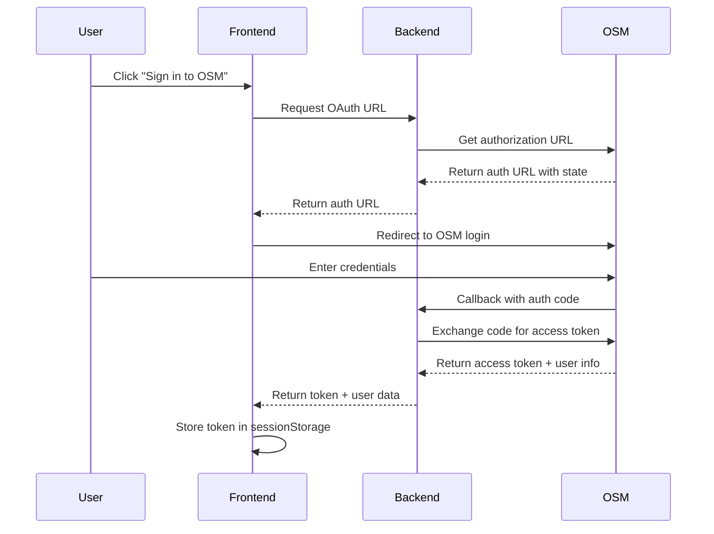

# Authentication Architecture
**OAuth 2.0 Integration with Online Scout Manager**

## Purpose
Secure authentication system that integrates with OSM's OAuth 2.0 service while maintaining user-friendly session management and offline capabilities.

## OAuth 2.0 Flow

### Authentication Sequence


## Token Management

### Storage Strategy
```javascript
// Frontend Token Storage
const TOKEN_STORAGE = {
  location: 'sessionStorage',     // Cleared on browser close
  encryption: false,              // OSM tokens are already secure
  expiry: 3600,                  // 1 hour maximum
  refresh: 300,                  // Refresh 5 min before expiry
  validation: 'server-side'      // Backend validates all tokens
};

// Storage Implementation
sessionStorage.setItem('osm_token', accessToken);
sessionStorage.setItem('token_expiry', Date.now() + 3600000);
sessionStorage.setItem('user_info', JSON.stringify(userInfo));
```

### Token Lifecycle
```javascript
// Token Validation
const isTokenValid = () => {
  const token = sessionStorage.getItem('osm_token');
  const expiry = sessionStorage.getItem('token_expiry');
  return token && expiry && Date.now() < parseInt(expiry);
};

// Automatic Refresh Logic
const checkTokenRefresh = async () => {
  const expiry = parseInt(sessionStorage.getItem('token_expiry') || '0');
  const timeUntilExpiry = expiry - Date.now();
  
  if (timeUntilExpiry < 300000) { // 5 minutes
    await refreshAuthToken();
  }
};
```

## Authentication States

### State Management
```javascript
const AUTH_STATES = {
  'no_data': 'No cached data available',
  'cached_only': 'Has offline data, no valid token', 
  'token_expired': 'Token expired, refresh needed',
  'authenticated': 'Valid token, full access',
  'syncing': 'Authentication in progress'
};

// State Transitions
const getAuthState = () => {
  const hasToken = isTokenValid();
  const hasCachedData = localStorage.getItem('viking_sections_offline');
  
  if (hasToken) return 'authenticated';
  if (hasCachedData) return 'cached_only';
  return 'no_data';
};
```

### Context-Aware UI
```javascript
// AuthButton Component Logic
const getButtonConfig = (authState) => {
  switch (authState) {
    case 'no_data':
      return { text: 'Sign in to OSM', variant: 'scout-purple' };
    case 'cached_only':
      return { text: 'Refresh data', variant: 'outline' };
    case 'token_expired':
      return { text: 'Sign in to refresh', variant: 'scout-purple' };
    case 'authenticated':
      return { text: 'Refresh', variant: 'outline' };
    case 'syncing':
      return { text: 'Syncing...', disabled: true };
  }
};
```

## Permission Model

### Section-Based Access
```javascript
// User Roles from OSM
const userRoles = {
  "123": {
    sectionname: "1st Walton Beavers",
    sectionid: 123,
    permissions: {
      member: ["read", "write"],
      events: ["read", "write"], 
      badge: ["read"]
    },
    isDefault: true
  }
};

// Permission Checking
const hasPermission = (sectionId, resource, action) => {
  const section = userRoles[sectionId];
  return section?.permissions[resource]?.includes(action) || false;
};
```

### Write Operation Guards
```javascript
// Prevent Offline Writes with Expired Token
const checkWritePermission = () => {
  if (!isTokenValid()) {
    throw new Error('Authentication required for write operations');
  }
  
  const isOffline = !navigator.onLine;
  const tokenExpired = Date.now() > parseInt(sessionStorage.getItem('token_expiry') || '0');
  
  if (isOffline && tokenExpired) {
    throw new Error('Cannot perform write operations while offline with expired token');
  }
};

// Usage in FlexiRecord Updates
const updateFlexiRecord = async (data) => {
  checkWritePermission(); // Throws if not allowed
  
  return await apiCall('/update-flexi-record', data);
};
```

## Circuit Breaker Pattern

### Authentication Failure Handling
```javascript
class AuthHandler {
  constructor() {
    this.authFailed = false;
    this.failureTime = null;
    this.failureCount = 0;
  }

  handleAPIResponse(response, apiName) {
    if (response.status === 401 || response.status === 403) {
      this.authFailed = true;
      this.failureTime = Date.now();
      this.failureCount++;
      
      logger.error('Authentication failed', { 
        apiName, 
        status: response.status,
        failureCount: this.failureCount 
      });
      
      // Clear invalid token
      sessionStorage.removeItem('osm_token');
      
      return false;
    }
    
    // Reset on successful auth
    if (response.ok) {
      this.authFailed = false;
      this.failureCount = 0;
    }
    
    return true;
  }

  shouldMakeAPICall() {
    // Stop API calls after auth failure until user re-authenticates
    return !this.authFailed;
  }
}
```

### Fallback Behavior
```javascript
// API Calls with Auth Circuit Breaker
const apiCallWithAuth = async (endpoint, options) => {
  // Check circuit breaker before making call
  if (!authHandler.shouldMakeAPICall()) {
    logger.info('Auth failed - using cached data only', { endpoint });
    throw new Error('Authentication required - please sign in');
  }
  
  const response = await fetch(endpoint, {
    ...options,
    headers: {
      'Authorization': `Bearer ${sessionStorage.getItem('osm_token')}`,
      ...options.headers
    }
  });
  
  // Update circuit breaker state
  if (!authHandler.handleAPIResponse(response, endpoint)) {
    throw new Error('Authentication failed');
  }
  
  return response;
};
```

## Security Considerations

### Token Security
```javascript
// Secure Request Implementation
const secureRequest = async (url, options) => {
  // Input validation
  if (url.length > 1000) {
    throw new Error('URL too long - potential DoS attack');
  }
  
  // Protocol validation
  const parsedUrl = new URL(url);
  if (!['http:', 'https:'].includes(parsedUrl.protocol)) {
    throw new Error('Invalid protocol - only HTTP/HTTPS allowed');
  }
  
  return fetch(url, {
    ...options,
    headers: {
      'Content-Type': 'application/json',
      'Authorization': `Bearer ${sessionStorage.getItem('osm_token')}`,
      ...options.headers
    }
  });
};
```

### Error Message Security
```javascript
// Safe Error Messages (don't expose internal details)
const createUserFriendlyError = (error) => {
  const safeMessages = {
    'UNAUTHORIZED': 'Please sign in to continue',
    'FORBIDDEN': 'Access denied',
    'TOKEN_EXPIRED': 'Session expired - please sign in',
    'RATE_LIMITED': 'Too many requests - please wait'
  };
  
  return safeMessages[error.code] || 'An unexpected error occurred';
};
```

## Offline Authentication

### Read-Only Access
```javascript
// Allow read operations with cached data when offline
const getDataWithAuth = async (endpoint) => {
  try {
    // Try authenticated API call first
    if (isTokenValid() && navigator.onLine) {
      return await apiCallWithAuth(endpoint);
    }
  } catch (authError) {
    logger.warn('Auth failed, falling back to cache', { endpoint });
  }
  
  // Fallback to cached data
  const cached = getCachedData(endpoint);
  if (cached) {
    return cached;
  }
  
  throw new Error('No data available - please sign in when online');
};
```

### Offline Indicators
```javascript
// UI State for Offline Authentication
const getOfflineAuthState = () => {
  const isOffline = !navigator.onLine;
  const hasValidToken = isTokenValid();
  const hasCachedData = !!localStorage.getItem('viking_sections_offline');
  
  if (isOffline && !hasValidToken && hasCachedData) {
    return {
      mode: 'offline_readonly',
      message: 'Offline mode - Limited functionality available',
      canWrite: false
    };
  }
  
  return { mode: 'normal', canWrite: hasValidToken };
};
```

## Integration Points

### Backend OAuth Proxy
- Handles OAuth callback URL validation
- Exchanges authorization codes for tokens
- Provides frontend URL detection for redirects
- Manages token refresh workflows

### Frontend Session Management
- Stores tokens in sessionStorage only
- Provides authentication state to all components
- Handles automatic logout on token expiry
- Manages user information display

### Error Handling Integration
- Reports auth failures to Sentry with context
- Provides fallback paths for all authenticated operations
- Maintains user experience during auth issues

---

*This authentication system provides secure, user-friendly access while maintaining offline capabilities and robust error handling.*