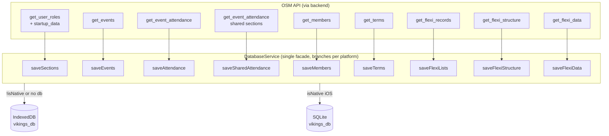
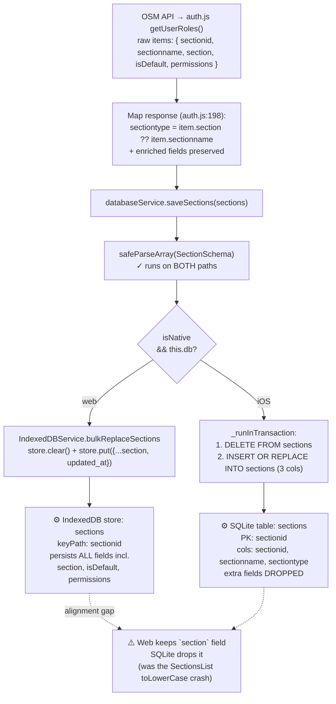
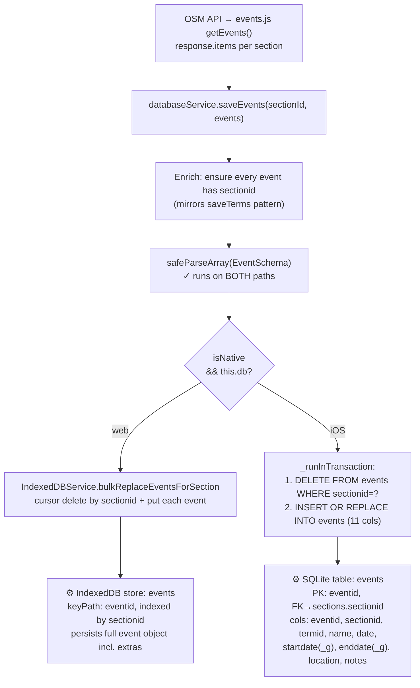
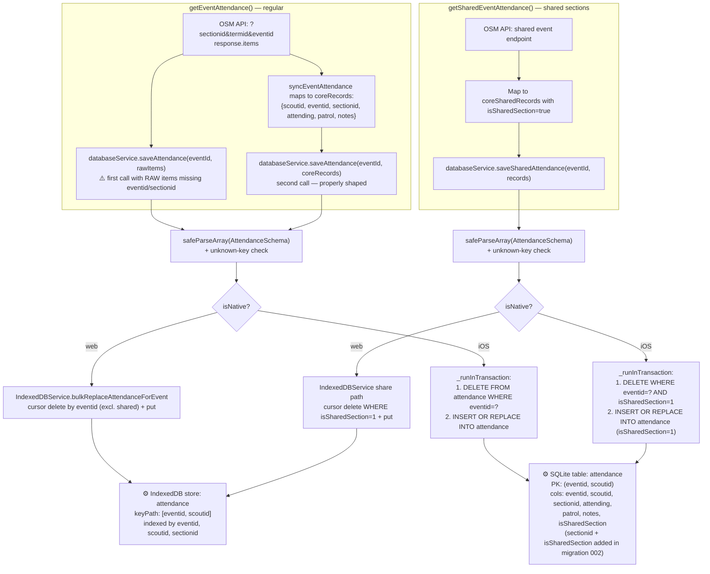
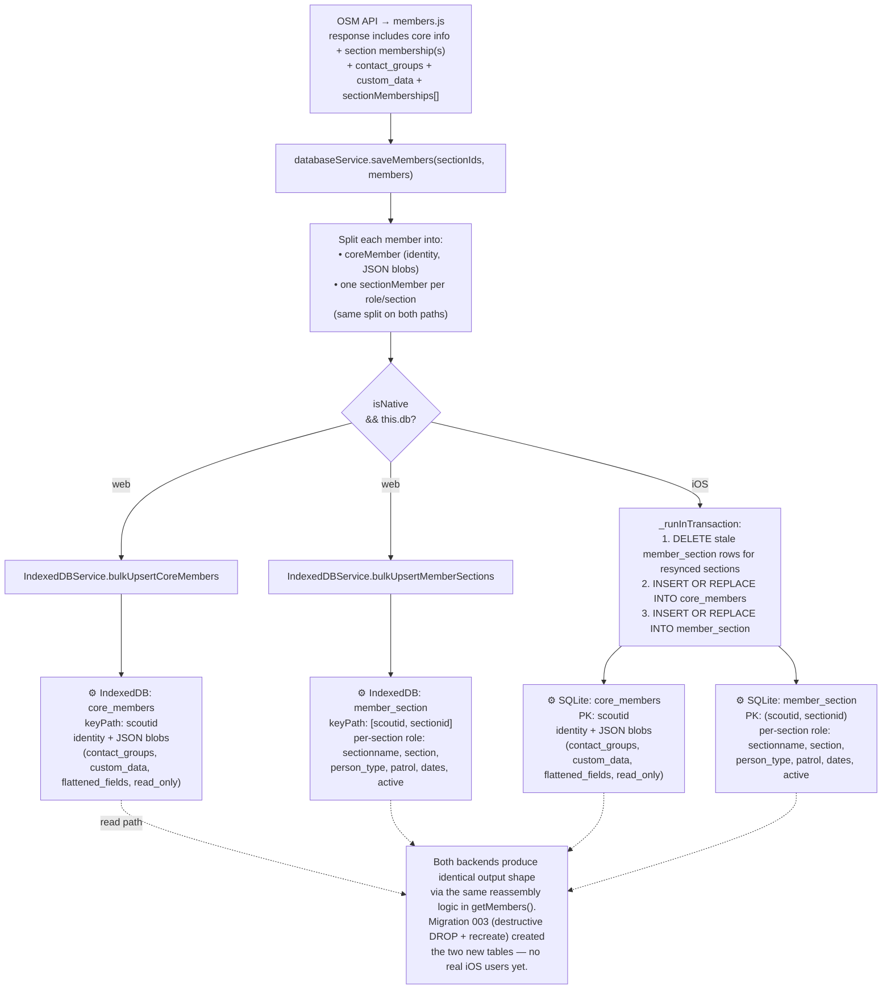

# Data Flows: API → IndexedDB & SQLite

How OSM API responses flow into the two storage backends — IndexedDB on web, SQLite on native iOS — and where the two diverge. Each section is a Mermaid diagram so it renders inline on GitHub and most Markdown viewers.

The point of this document is to make alignment (or misalignment) between the two backends visible at a glance. The "Alignment status" table at the end lists the concrete gaps that still need closing.

---

## 1. Top-level overview

Every save goes through `databaseService` which branches per platform. IndexedDB is used both as the web fallback and (separately) for a couple of utility caches on iOS — but the main data is split as shown.

---

## 2. Sections

---

## 3. Events

---

## 4. Attendance (regular + shared)

---

## 5. Members — dual-store on both backends

Both backends now use the same normalised dual-store schema. `saveMembers` splits each member identically on both paths — core identity into one store/table, per-section role data into another — and `getMembers` reassembles the identical output shape on both sides. This resolved the production bug where `member.sections` was empty on iOS, breaking detailed attendance views.

---

## 6. Terms, Flexi (homogeneous patterns)

These follow the same DELETE+INSERT-in-transaction shape as the others. Drawn together since they share structure.

```mermaid
flowchart TB
  subgraph Terms[" "]
    TA[OSM API: terms]
    TA --> TSave[saveTerms]
    TSave --> TVal[validate at top]
    TVal --> TBranch{native?}
    TBranch -->|web| TIDBOP[bulkReplaceTermsForSection]
    TBranch -->|iOS| TSQL["DELETE + INSERT OR REPLACE in transaction"]
    TIDBOP --> TIDB[("IndexedDB: terms<br/>keyPath: termid")]
    TSQL --> TSQLite[("SQLite: terms<br/>PK: termid")]
  end

  subgraph FlexiLists[" "]
    FA[OSM API: flexi list]
    FA --> FSave[saveFlexiLists]
    FSave --> FVal[validate at top]
    FVal --> FBranch{native?}
    FBranch -->|web| FIDB1[bulkReplaceFlexiListsForSection]
    FBranch -->|iOS| FSQL1[DELETE + INSERT OR REPLACE in transaction]
    FIDB1 --> FStore[("IndexedDB: flexi_lists")]
    FSQL1 --> FSQLite[("SQLite: flexi_lists")]
  end

  subgraph FlexiData[" "]
    FDA[OSM API: flexi data]
    FDA --> FDSave[saveFlexiData]
    FDSave --> FDVal[validate at top]
    FDVal --> FDBranch{native?}
    FDBranch -->|web| FDIDB[bulkReplace via index cursor]
    FDBranch -->|iOS| FDSQL["DELETE + INSERT OR REPLACE INTO flexi_data in transaction"]
    FDIDB --> FDStore[("IndexedDB: flexi_data")]
    FDSQL --> FDSQLite[("SQLite: flexi_data<br/>PK: extraid+sectionid+termid+scoutid")]
  end
```

---

## Alignment status (at a glance)

| Entity | Validation | Upsert semantics | Field shape | Status |
|---|---|---|---|---|
| sections | ✅ both paths | ✅ both upsert | ⚠️ web keeps `section`, SQLite drops it | UI fixed by reading `sectiontype` |
| events | ✅ both paths | ✅ both upsert (INSERT OR REPLACE) | ✅ same fields | OK |
| attendance | ✅ both paths | ✅ both upsert (after recent fix) | ✅ aligned (since migration 002) | OK |
| shared attendance | ✅ both paths | ✅ both upsert (after recent fix) | ✅ aligned | OK |
| members | ❌ neither path validates | ✅ both upsert | ✅ NOW structurally aligned via dual-store (migration 003) | OK |
| terms | ✅ both paths | ✅ both upsert (INSERT OR REPLACE) | ✅ same fields | OK |
| flexi_lists | ✅ both paths | ✅ both upsert | ✅ aligned | OK |
| flexi_data | ✅ both paths | ✅ both upsert (INSERT OR REPLACE INTO flexi_data) | ✅ aligned | OK |
| flexi_structure | ✅ both paths | ✅ INSERT OR REPLACE single row | ✅ aligned | OK |

### Concrete follow-ups

1. **Strengthen the schema-parity test** (Layer 2) to flag plain `INSERT INTO` (vs `INSERT OR REPLACE INTO`) on tables that are bulk-rewritten via DELETE+INSERT — would catch upsert gaps at static-analysis time before they reach production.

All saved entities now produce identical output shapes between backends. The dual-store members refactor (migration 003) closes the last structural asymmetry.

---

_Last updated: 2026-04-28. Maintainer note: when adding a new save path, add a node to the relevant diagram and a row to the alignment table — keeps both backends visible to reviewers._
