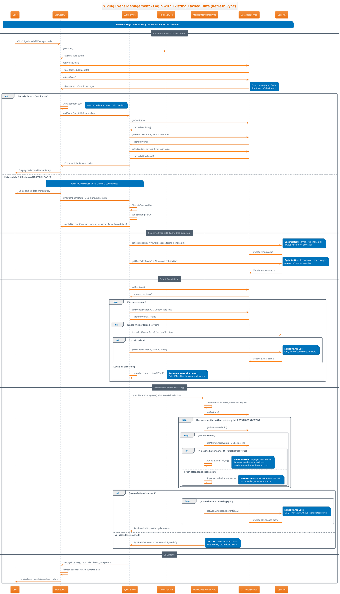

# Viking Event Management Sync System - UML Sequence Diagrams

This document provides comprehensive UML sequence diagrams documenting the complete Viking Event Management sync system flows, based on the recent debugging work and codebase architecture.

## Context: Recent Fix

We recently fixed a critical bug in `collectEventsRequiringAttendanceSync()` where the method was processing sections without events, causing zero attendance syncing. The fix ensures only sections with events are processed:

**Before Fix:** All sections processed → finds 0 events → no attendance API calls
**After Fix:** Only sections with `events.length > 0` processed → finds actual events → makes attendance API calls

## Diagram 1: Fresh Login with Clear Database (Full Sync)

This shows the complete flow from OAuth authentication through full data population.

```plantuml
@startuml Fresh_Login_Full_Sync
!theme aws-orange

title Viking Event Management - Fresh Login with Clear Database (Full Sync)

participant "User" as U
participant "Browser/UI" as B
participant "SyncService" as SS
participant "TokenService" as TS
participant "AuthHandler" as AH
participant "AtomicAttendanceSync" as AAS
participant "DatabaseService" as DS
participant "OSM API" as API

note over U,API: **Scenario: First-time login with empty database**

== OAuth Authentication Phase ==
U -> B: Click "Sign in to OSM"
B -> TS: generateOAuthUrl()
TS -> B: OAuth URL with state parameter
B -> API: Redirect to OSM OAuth
API -> U: OAuth consent page
U -> API: Grant permissions
API -> B: Redirect with auth code
B -> TS: setToken(accessToken)
note right: Token stored in sessionStorage
TS -> AH: reset() // Clear circuit breaker
TS -> B: Authentication complete

== Sync Dashboard Data Orchestration ==
B -> SS: syncDashboardData()
note right: Main orchestration method

SS -> SS: Check isSyncing flag
alt isSyncing is false
    SS -> SS: Set isSyncing = true
    SS -> B: notifyListeners({status: 'syncing', message: 'Loading core data...'})

    SS -> SS: isOnline()
    SS -> SS: checkTokenAndPromptLogin()
    SS -> TS: getToken()
    TS -> SS: Valid token returned
    SS -> TS: validateToken()
    TS -> SS: Token valid

    SS -> AH: reset() // Reset circuit breaker for refresh

    == Core Data Sync Phase ==
    SS -> SS: syncTerms(token)
    SS -> API: GET /terms
    note right: **API Endpoint:** /terms\nLoads all terms for all sections
    API -> DS: Store terms data
    SS -> B: notifyListeners({message: 'Terms loaded...'})

    SS -> SS: syncSections(token)
    SS -> API: GET /sections (via getUserRoles)
    note right: **API Endpoint:** /sections\nLoads user roles and sections
    API -> DS: Store sections data
    SS -> B: notifyListeners({message: 'Sections loaded...'})

    == Events Sync Phase ==
    SS -> DS: getSections()
    DS -> SS: sections[]

    loop For each section
        SS -> SS: syncEvents(sectionId, token)
        SS -> API: fetchMostRecentTermId(sectionId, token)
        note right: **API Endpoint:** /sections/{sectionId}/terms\nFinds most recent term

        alt termId exists (not waiting list)
            API -> SS: termId
            SS -> API: getEvents(sectionId, termId, token)
            note right: **API Endpoint:** /events/{sectionId}/{termId}\nRetrieves events for section
            API -> DS: Store events data
            SS -> B: notifyListeners({message: 'Events synced for section {sectionId}...'})
        else no termId (waiting list)
            API -> SS: null
            SS -> SS: Skip section (normal for waiting lists)
            note right: **Recent Fix Context:**\nWaiting lists have no events\nThese sections are now properly excluded\nfrom attendance sync processing
        end
    end

    == FlexiRecord Static Data Preload ==
    SS -> SS: preloadStaticFlexiRecordData(sections, token)

    loop For each section
        SS -> API: getFlexiRecords(sectionId, token)
        note right: **API Endpoint:** /flexirecords/{sectionId}\nLoads FlexiRecord lists
        API -> DS: Cache FlexiRecord lists
    end

    loop For each Viking FlexiRecord
        SS -> API: getFlexiStructure(recordId, sectionId, token)
        note right: **API Endpoint:** /flexirecords/structure/{recordId}\nLoads record structures for\n"Viking Event Mgmt" and "Viking Section Movers"
        API -> DS: Cache FlexiRecord structures
    end

    SS -> B: notifyListeners({message: 'FlexiRecord structures loaded...'})

    == Atomic Attendance Sync Phase ==
    note over SS,AAS: **CRITICAL FIX: Enhanced attendance sync with proper event filtering**

    SS -> DS: getSections() // Pre-sync validation
    DS -> SS: sections[]

    SS -> SS: Count events across all sections
    loop For each section
        SS -> DS: getEvents(sectionId)
        DS -> SS: events[] for section
        note right: **Fix Applied:** Only count sections\nwith events.length > 0
    end

    SS -> B: notifyListeners({message: 'Loading attendance data...', timestamp: now})
    SS -> AAS: syncAllAttendance(token)

    AAS -> AAS: collectEventsRequiringAttendanceSync()
    AAS -> DS: getSections()
    DS -> AAS: sections[]

    loop For each section
        AAS -> DS: getEvents(sectionId)
        DS -> AAS: events[] for section

        alt events.length > 0 **[FIXED CONDITION]**
            loop For each event in section
                alt !hasAttendanceData || forceRefresh
                    AAS -> AAS: Add event to eventsToSync[]
                    note right: **Recent Fix:** Only events from sections\nwith actual events are processed
                else attendance exists and !forceRefresh
                    AAS -> AAS: Skip event (has cached data)
                end
            end
        else events.length == 0 **[FIXED - SKIP SECTION]**
            AAS -> AAS: Skip section entirely
            note right: **Recent Fix Applied:**\nSections without events (e.g., waiting lists)\nare now properly excluded from processing
        end
    end

    AAS -> AAS: Begin atomic transaction

    loop For each event in eventsToSync
        AAS -> API: getEventAttendance(sectionId, eventId, termId, token)
        note right: **API Endpoint:** /attendance/{eventId}\nRetrieves attendance records for event

        alt Shared event detection enabled
            AAS -> API: getEventSummary(eventId, token)
            note right: **API Endpoint:** /events/summary/{eventId}\nChecks if event is shared

            alt Event is shared
                AAS -> API: getEventSharingStatus(eventId, sectionId, token)
                note right: **API Endpoint:** /events/sharing/{eventId}\nRetrieves cross-section attendance
                API -> DS: Store shared event metadata
            end
        end

        API -> AAS: Attendance data
        AAS -> DS: saveAttendance(eventId, attendanceData)
        AAS -> B: notifyListeners({progress: current/total, message: 'Synced {eventName}'})
    end

    AAS -> AAS: Commit transaction
    AAS -> SS: SyncResult(success=true, recordsSynced=count)

    SS -> SS: Set completion timestamp
    SS -> DS: setLastSync(timestamp)

    == Completion Notification ==
    SS -> B: notifyListeners({status: 'dashboard_complete', message: 'All data loaded including attendance', timestamp})

    B -> B: Dashboard refreshes with complete data
    B -> U: Show event cards with attendance counts

else isSyncing is true
    SS -> B: Skip sync (already in progress)
end

@enduml
```



## Diagram 2: Login with Existing Cached Data (Refresh Sync)

This shows the flow when data already exists in cache, highlighting selective syncing behavior.



## Diagram 3: Event Dashboard Loading (UI Rendering)

This shows how the UI loads and displays event cards from cached data.

```plantuml
@startuml Event_Dashboard_Loading
!theme aws-orange

title Viking Event Management - Event Dashboard Loading (UI Rendering)

participant "User" as U
participant "EventDashboard" as ED
participant "EventCard" as EC
participant "DatabaseService" as DS
participant "EventDashboardHelpers" as EDH
participant "UnifiedStorageService" as USS

note over U,USS: **Scenario: Dashboard component mounting and rendering event cards**

== Component Initialization ==
U -> ED: Navigate to dashboard
ED -> ED: useEffect() - Component mount
ED -> ED: Set mounted = true, isMountedRef.current = true

== Data Loading Orchestration ==
ED -> ED: loadEventCards(isRefresh = false)
note right: **Primary data loading function**

ED -> DS: getSections()
DS -> ED: sections[] from SQLite cache

alt sections.length > 0
    ED -> EDH: buildEventCards(sections, null) // Cache-only mode
    note right: **Cache-First Strategy:** Always try cache first\nfor immediate UI responsiveness

    == Section Events Loading ==
    loop For each section
        EDH -> DS: getEvents(sectionId)
        DS -> EDH: events[] from cache

        note over EDH: **Filter events by date range:**\nFuture events + events from last 7 days
        EDH -> EDH: filterEventsByDateRange(events, oneWeekAgo)
        EDH -> EDH: filteredEvents[]
    end

    == Attendance Data Loading ==
    loop For each filtered event
        EDH -> DS: getAttendance(eventId) // Cache-only lookup

        alt Attendance data exists in cache
            DS -> EDH: attendanceData[]
            EDH -> EDH: attendanceMap.set(eventId, attendanceData)
            note right: **Performance:** Immediate data from SQLite\nNo API calls during UI render
        else No cached attendance
            DS -> EDH: null or empty array
            EDH -> EDH: attendanceMap.set(eventId, [])
            note right: **Graceful Degradation:** Show event card\nwith "No attendance data" state
        end
    end

    == Shared Events Processing ==
    EDH -> EDH: expandSharedEvents(filteredEvents, attendanceMap)
    note right: **Shared Event Detection:**\nExpands events that are shared across sections\nusing cached metadata from localStorage

    alt Event has shared metadata
        EDH -> EDH: Expand event to show all participating sections
        note right: **Multi-Section Display:**\nSingle event card shows attendance\nfrom multiple scout sections
    end

    == Event Grouping & Card Building ==
    EDH -> EDH: groupEventsByName(expandedEvents)
    note right: **Smart Grouping:** Events with same name\nbut different sections/dates are grouped\ninto single cards with multiple instances

    loop For each event group
        EDH -> EDH: buildEventCard(eventName, eventsWithAttendance)

        EDH -> EDH: Calculate card properties:
        note right: **Card Calculations:**\n• Total attendance across all instances\n• Earliest event date for sorting\n• Section names involved\n• Attendance status counts

        EDH -> EDH: card = {
        note right: **Card Structure:**\n• id: unique identifier\n• name: event name\n• events: array of event instances\n• totalAttendance: sum across instances\n• earliestDate: for sorting\n• sections: involved section names\n• originalEvents: for navigation integrity

        EDH -> EDH: cards.push(card)
    end

    == Card Sorting & Response ==
    EDH -> EDH: Sort cards by earliestDate (chronological)
    EDH -> ED: Return cards[]

    alt cards.length > 0
        ED -> ED: setEventCards(cards)
        ED -> ED: setLoading(false)

        == Last Sync Display ==
        ED -> USS: getLastSync()
        USS -> ED: timestamp
        ED -> ED: setLastSync(new Date(timestamp))

        ED -> ED: Render dashboard with event cards

        == Event Cards Rendering ==
        loop For each card in cards
            ED -> EC: Render EventCard component
            EC -> EC: Display card with:
            note right: **Card Display Elements:**\n• Event name and date range\n• Total attendance count\n• Section badges\n• "View Attendees" button\n• Loading states for interactions

            EC -> U: Interactive event card displayed
        end

    else cards.length == 0 AND no token
        ED -> ED: Show "Click Sign in to OSM" message
        ED -> U: Empty state with login prompt

    else cards.length == 0 AND has token
        ED -> ED: Show "No upcoming events" message
        ED -> U: Empty state with refresh suggestion
    end

else sections.length == 0
    ED -> ED: setEventCards([])
    ED -> ED: setLoading(false)
    ED -> U: Empty dashboard - no sections configured
end

== Background Sync Check ==
ED -> USS: getLastSync()
USS -> ED: lastSyncTimestamp

ED -> ED: Check if data is stale (> 30 minutes)
alt Data is stale AND hasToken AND !authFailed
    ED -> ED: Set background sync timeout
    note right: **Background Strategy:** Show cached data immediately,\noptionally refresh in background\nwithout blocking UI
else Data is fresh OR no token OR auth failed
    ED -> ED: Skip background sync
    note right: **Performance:** No unnecessary background\nAPI calls when data is fresh
end

@enduml
```



## Diagram 4: Event Attendance Card Opening (View Attendees)

This shows the detailed flow when user clicks "View Attendees" on an event card.

```plantuml
@startuml Event_Attendance_Card_Opening
!theme aws-orange

title Viking Event Management - Event Attendance Card Opening (View Attendees)

participant "User" as U
participant "EventDashboard" as ED
participant "EventCard" as EC
participant "AttendanceModal" as AM
participant "DatabaseService" as DS
participant "TokenService" as TS
participant "OSM API" as API

note over U,API: **Scenario: User clicks "View Attendees" button on an event card**

== User Interaction ==
U -> EC: Click "View Attendees" button
EC -> ED: handleViewAttendees(eventCard)

ED -> ED: setLoadingAttendees(eventCard.id)
note right: **UI State:** Show loading spinner\non specific event card button

== Section ID Extraction ==
ED -> ED: Extract unique section IDs from eventCard.events
note right: **Multi-Section Support:**\nEvent cards may contain events from multiple sections\n(e.g., shared events, joint activities)

ED -> ED: sectionIds = Array.from(new Set(eventCard.events.map(event => event.sectionid)))

== Member Data Loading Strategy ==

ED -> DS: getMembers(sectionIds) // Cache lookup first
note right: **Stage 3: On-demand member loading**\n**Cache-First Strategy:** Always check cache before API

alt Members found in cache
    DS -> ED: members[] from SQLite
    note right: **Performance Path:** Immediate data\nfrom local SQLite cache

    ED -> ED: Log: "Using cached members for attendance view"
    ED -> ED: Navigate to attendance view immediately
    ED -> AM: Display attendance with cached member data

else No cached members found
    ED -> ED: Log: "No cached members found - fetching on-demand"

    == Authentication Check ==
    ED -> TS: getToken()

    alt No valid token
        TS -> ED: null
        ED -> TS: generateOAuthUrl()
        TS -> ED: OAuth URL
        ED -> U: window.location.href = oauthUrl (redirect to login)
        note right: **Auth Redirect:** User must authenticate\nbefore accessing member data

    else Valid token exists
        TS -> ED: valid access token

        == API Member Fetch ==
        ED -> ED: Find section objects for sectionIds
        ED -> ED: involvedSections = sections.filter(...)

        ED -> API: getListOfMembers(involvedSections, token)
        note right: **API Endpoint:** /members/{sectionId}/{termId}\n**On-Demand Loading:** Only called when\ncache miss occurs and user needs data

        alt API call successful
            loop For each section
                API -> DS: Store members in SQLite cache
                note right: **Caching Strategy:** Store fetched members\nfor future cache hits
            end

            API -> ED: members[] (fresh from API)
            ED -> ED: Log: "Successfully fetched members on-demand"

        else Authentication error (401/403/Token expired)
            API -> ED: AuthError
            ED -> TS: generateOAuthUrl()
            TS -> ED: OAuth URL
            ED -> U: window.location.href = oauthUrl
            note right: **Token Refresh Flow:** Handle expired tokens\nby redirecting to OAuth for refresh

        else Other API error
            API -> ED: APIError
            ED -> ED: Log error and continue with empty members
            ED -> ED: members = [] // Graceful degradation
            note right: **Error Resilience:** Show attendance view\neven if member fetch fails
        end
    end
end

== Navigation to Attendance View ==
ED -> ED: eventsToNavigate = eventCard.originalEvents || eventCard.events
note right: **Data Integrity:** Use originalEvents to preserve\ntermId and other metadata for proper navigation

ED -> AM: onNavigateToAttendance(eventsToNavigate, members)

== Attendance Modal Display ==
AM -> AM: Initialize attendance view with:
note right: **Modal Content:**\n• Event details (name, date, sections)\n• Member list with attendance status\n• Present/Absent/Unknown counts\n• Section-wise breakdown

== Attendance Data Processing ==
loop For each event in eventsToNavigate
    AM -> DS: getAttendance(event.eventid) // Already cached from sync
    DS -> AM: attendanceData[]

    AM -> AM: Match attendance records with member data

    loop For each member in members
        alt Member has attendance record
            AM -> AM: Mark as Present/Absent based on attending field
            note right: **Status Mapping:**\n• attending: 'Yes' → Present\n• attending: 'No' → Absent\n• no record → Unknown
        else No attendance record
            AM -> AM: Mark as Unknown
        end
    end
end

== Real-time Attendance Display ==
AM -> AM: Calculate summary statistics:
note right: **Summary Calculations:**\n• Total members across sections\n• Present count\n• Absent count\n• Unknown count\n• Percentage attendance

loop For each section involved
    AM -> AM: Group members by section
    AM -> AM: Calculate section-specific stats

    loop For each member in section
        AM -> AM: Display member row:
        note right: **Member Row Display:**\n• Name (firstname lastname)\n• Section badge\n• Attendance status (Present/Absent/Unknown)\n• Additional member details if available

        AM -> U: Render member attendance row
    end
end

== Interactive Features ==
alt Shared event with multiple sections
    AM -> AM: Show section tabs or filters
    AM -> U: Allow user to filter by section
    note right: **Multi-Section UX:** Enable users to view\nattendance breakdown by scout section
end

alt Member details available
    U -> AM: Click member name
    AM -> AM: Show member detail popup
    note right: **Member Details:** Medical info,\ncontact details, badges, etc.\n(if cached during member sync)
end

== Cleanup ==
ED -> ED: setLoadingAttendees(null)
note right: **UI State Cleanup:** Remove loading spinner\nfrom event card button

== Error Handling Paths ==

alt Cache errors
    DS -> ED: CacheError
    ED -> ED: Log warning and continue with empty members
    note right: **Graceful Degradation:** Continue with empty\nmember list rather than blocking UI
end

alt Network failures during API fetch
    API -> ED: NetworkError
    ED -> ED: Log error and show attendance without member names
    note right: **Offline Resilience:** Show attendance data\neven without member details
end

alt Corrupted attendance data
    DS -> AM: Malformed attendance data
    AM -> AM: Filter and validate data
    AM -> U: Show valid records, log warnings for invalid ones
    note right: **Data Validation:** Handle corrupted or\nmalformed attendance records gracefully
end

@enduml
```



## Technical Implementation Notes

### Recent Fix Details

The critical fix in `collectEventsRequiringAttendanceSync()` addresses this logic:

**Before (Buggy):**
```javascript
for (const section of sections) {
  const sectionEvents = await databaseService.getEvents(section.sectionid);
  // BUG: Processing all sections, even those without events
  // This led to 0 events being found for attendance sync
}
```

**After (Fixed):**
```javascript
for (const section of sections) {
  const sectionEvents = await databaseService.getEvents(section.sectionid);
  if (sectionEvents && Array.isArray(sectionEvents) && sectionEvents.length > 0) {
    // FIXED: Only process sections that actually have events
    // This ensures attendance sync finds real events
  } else {
    // Log and skip sections without events (e.g., waiting lists)
  }
}
```

### Key API Endpoints Documented

| Endpoint | Purpose | Used In |
|----------|---------|---------|
| `GET /terms` | Load all terms for sections | Fresh sync |
| `GET /sections` | Load user roles and sections | Fresh sync |
| `GET /events/{sectionId}/{termId}` | Retrieve events for section | Event sync |
| `GET /attendance/{eventId}` | Retrieve attendance records | Attendance sync |
| `GET /members/{sectionId}/{termId}` | Retrieve member details | On-demand loading |
| `GET /events/summary/{eventId}` | Check if event is shared | Shared event detection |
| `GET /events/sharing/{eventId}` | Get cross-section attendance | Shared event sync |
| `GET /flexirecords/{sectionId}` | Load FlexiRecord lists | Static data preload |

### Database Operations

| Operation | Purpose | Transaction Support |
|-----------|---------|-------------------|
| `saveAttendance(eventId, data)` | Store attendance records | Yes (Atomic sync) |
| `getAttendance(eventId)` | Retrieve cached attendance | No |
| `getSections()` | Get all user sections | No |
| `getEvents(sectionId)` | Get events for section | No |
| `getMembers(sectionIds)` | Get member details | No |
| `setLastSync(timestamp)` | Update sync timestamp | No |

### Error Handling Patterns

1. **Authentication Errors (401/403)**: Automatic OAuth redirect
2. **Network Failures**: Circuit breaker pattern via AuthHandler
3. **Cache Misses**: Graceful fallback to empty data or API fetch
4. **Partial Sync Failures**: AtomicAttendanceSync rollback mechanism
5. **Corrupted Data**: Validation and filtering of malformed records

### Performance Optimizations

1. **Cache-First Loading**: Always check SQLite before API calls
2. **Background Sync**: Refresh data without blocking UI
3. **Selective Sync**: Only sync changed or missing data
4. **Atomic Transactions**: All-or-nothing attendance sync
5. **Smart Event Filtering**: Skip sections without events (recent fix)

These diagrams provide comprehensive documentation of the sync system architecture and can be used for debugging, onboarding new developers, and system maintenance.