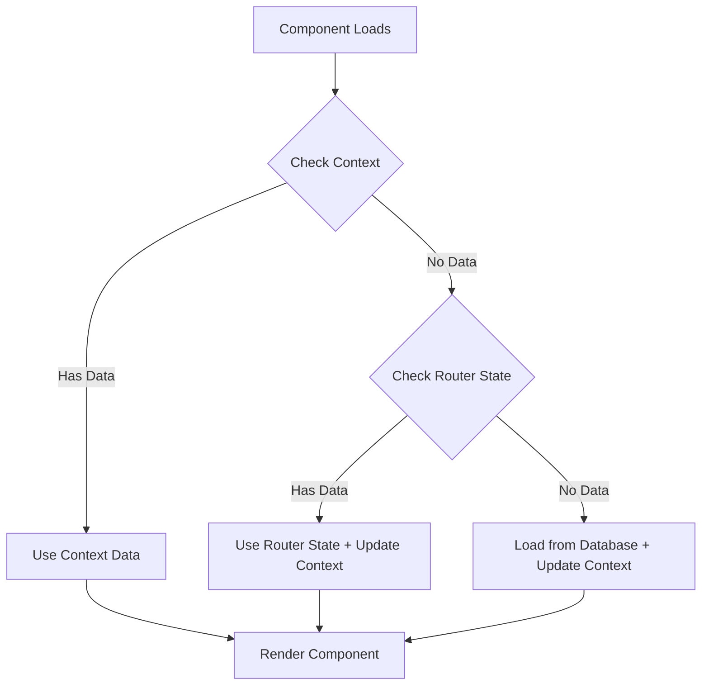
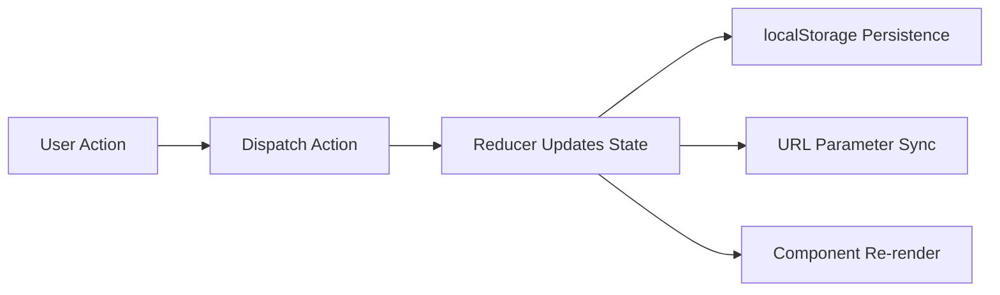

# State Management Architecture

## Overview

The Viking Event Management mobile application uses a hybrid state management approach that combines React Context with URL-based routing for optimal user experience and offline functionality.

## Architecture Components

### 1. AppStateContext - Central State Management

The `AppStateContext` provides centralized state management with automatic persistence and URL synchronization.

**Location**: `src/contexts/app/AppStateContext.tsx`

#### State Structure
```typescript
interface AppState {
  navigationData: NavigationData;  // Event/member data for navigation
  currentView: string;            // Current application view
  isRefreshing: boolean;          // UI refresh state
  isSyncing: boolean;            // Data synchronization state
  lastSyncTime: string | null;   // Last successful sync timestamp
}

interface NavigationData {
  events?: any[];         // Cached event data
  members?: any[];        // Cached member data
  selectedEvent?: string; // Currently selected event
  selectedSection?: string; // Currently selected section
}
```

#### Key Features
- **Automatic localStorage Persistence**: All state changes are automatically persisted
- **URL Synchronization**: Selected events and sections are reflected in URL parameters
- **Multi-source Data Loading**: Context → Router state → Database fallback strategy
- **TypeScript Support**: Full type safety for state operations

### 2. URL Synchronization Hook

The `useURLSync` hook provides bidirectional synchronization between application state and URL parameters.

**Location**: `src/hooks/useURLSync.js`

#### Core Functions
```javascript
const {
  syncStateToURL,        // Sync app state to URL parameters
  navigateWithState,     // Navigate while preserving state
  updateNavigationData,  // Update context with automatic URL sync
  searchParams,          // Current URL parameters
  navigationData         // Current navigation state
} = useURLSync();
```

#### URL Parameters
- `event`: Selected event name for deep linking
- `section`: Selected section ID for filtering

## State Flow Patterns

### 1. Data Loading Strategy

Components follow a multi-source loading pattern for optimal performance:



### 2. State Updates

All state mutations flow through the context reducer with automatic persistence:



## Implementation Examples

### Component Integration

```jsx
import { useAppState } from '../../contexts/app';
import { useURLSync } from '../../hooks/useURLSync.js';

function EventsDetail() {
  const { state } = useAppState();
  const { navigateWithState, updateNavigationData } = useURLSync();
  
  // Multi-source data loading
  useEffect(() => {
    const loadEventData = async () => {
      // 1. Check app state context first
      if (state.navigationData.events?.length > 0) {
        setEvents(state.navigationData.events);
        return;
      }
      
      // 2. Load from database
      const eventsData = await databaseService.getEvents();
      setEvents(eventsData);
      
      // 3. Update context for future use
      updateNavigationData({
        events: eventsData,
        selectedEvent: eventName
      });
    };
    
    loadEventData();
  }, [state.navigationData, updateNavigationData]);
  
  // Navigation with state preservation
  const handleBackToOverview = () => {
    navigateWithState('/events/overview', {
      preserveParams: true,
      state: { events, members }
    });
  };
}
```

### URL Parameter Usage

```jsx
// Reading URL parameters
const { eventId } = useParams();
const decodedEventName = decodeURIComponent(eventId);

// Updating URL with state
updateNavigationData({
  selectedEvent: decodedEventName,
  events: eventData
});
```

## Storage Integration

### localStorage Persistence

State is automatically persisted using the existing `storageUtils.js` infrastructure:

```javascript
// Storage keys used by AppStateContext
const STORAGE_KEYS = {
  NAVIGATION_DATA: 'viking_navigation_data',
  CURRENT_VIEW: 'viking_current_view',
  LAST_SYNC_TIME: 'viking_last_sync_time'
};
```

### Offline Compatibility

The state management system maintains full offline functionality:

1. **Initial Load**: State is restored from localStorage on app startup
2. **Offline Operation**: All state changes continue to work without network
3. **Data Persistence**: Events, members, and navigation state cached locally
4. **Sync Integration**: Compatible with existing sync service patterns

## Migration Guide

### For Existing Components

When updating components to use the new state management:

1. **Add Context Hooks**:
```jsx
import { useAppState } from '../../contexts/app';
import { useURLSync } from '../../hooks/useURLSync.js';
```

2. **Replace Local State**:
```jsx
// Before
const [events, setEvents] = useState([]);

// After
const { state } = useAppState();
const events = state.navigationData.events || [];
```

3. **Update Navigation**:
```jsx
// Before
navigate('/events/detail', { state: { events, members } });

// After
const { navigateWithState } = useURLSync();
navigateWithState('/events/detail', {
  preserveParams: true,
  state: { events, members }
});
```

### URL Parameter Migration

Components using URL parameters should follow this pattern:

1. **Extract Parameters**: Use React Router's `useParams`
2. **Update Context**: Call `updateNavigationData` when data loads
3. **Preserve State**: Use `navigateWithState` for navigation

## Best Practices

### State Management

1. **Use Multi-source Loading**: Always check context first, then fallback to database
2. **Update Context**: When loading new data, update the context for other components
3. **Preserve URL Parameters**: Use `preserveParams: true` for navigation
4. **Handle Loading States**: Show appropriate loading indicators during data fetches

### Performance Optimization

1. **Context Efficiency**: Only store necessary data in context
2. **URL Parameters**: Keep URL parameters minimal and user-friendly
3. **localStorage**: Rely on existing `safeGetItem`/`safeSetItem` utilities
4. **Memoization**: Use React.useMemo for expensive computations

### Error Handling

1. **Fallback Strategy**: Always provide fallback data sources
2. **Storage Errors**: Handled automatically by `storageUtils.js`
3. **Navigation Errors**: Use try-catch blocks for navigation operations
4. **State Validation**: Validate state structure before using

## Development Guidelines

### Adding New State

1. Update `AppState` interface in `AppStateContext.tsx`
2. Add corresponding reducer actions
3. Implement localStorage persistence if needed
4. Update URL synchronization if applicable
5. Document the new state in this file

### Testing Considerations

- Test state persistence across browser refreshes
- Verify URL parameter synchronization
- Test offline functionality
- Validate multi-source data loading
- Check backward compatibility with legacy components

## Troubleshooting

### Common Issues

1. **State Not Persisting**: Check localStorage permissions and storage utilities
2. **URL Parameters Not Syncing**: Verify `useURLSync` hook usage
3. **Context Not Updating**: Ensure proper dispatcher usage
4. **Performance Issues**: Review context data size and memoization

### Debugging Tools

- Browser DevTools → Application → Local Storage (check `viking_*` keys)
- React DevTools → Context values
- Network tab for sync operations
- Console logging via structured logger

## Future Enhancements

### Planned Improvements

1. **Redux Toolkit Migration**: Consider Redux Toolkit for complex state scenarios
2. **State Selectors**: Implement memoized selectors for better performance
3. **Middleware Support**: Add middleware for state change logging
4. **Type Safety**: Expand TypeScript coverage for all state operations

This architecture provides a solid foundation for scalable state management while maintaining offline-first principles and URL-based navigation compatibility.