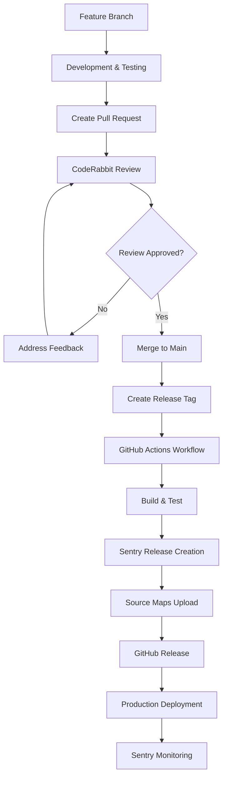

# Release Process Documentation

## Overview

This document outlines the complete release process for the Vikings Event Management mobile application, from initial development through production deployment with comprehensive error tracking.

## Release Workflow Architecture



## Phase 1: Feature Development & Pull Request Creation

### 1.1 Branch Creation
```bash
# Create feature branch from main
git checkout main
git pull origin main
git checkout -b feature/descriptive-name

# Example: git checkout -b feature/fix-viking-event-mgmt-1k
```

### 1.2 Development Workflow
```bash
# Make changes and test locally
npm run test:run    # Unit tests
npm run lint        # Code quality
npm run build       # Production build

# Commit with descriptive messages
git add .
git commit -m "feat: implement error boundaries with source maps

- Enhanced ErrorBoundary with security features
- Fixed source map configuration for debugging
- Added comprehensive URL parameter redaction

🤖 Generated with [Claude Code](https://claude.ai/code)

Co-Authored-By: Claude <noreply@anthropic.com>"
```

### 1.3 Pull Request Creation
```bash
# Push feature branch
git push origin feature/fix-viking-event-mgmt-1k

# Create PR via GitHub CLI
gh pr create --title "🔧 Fix VIKING-EVENT-MGMT-1K: Enhanced Error Boundaries and Source Maps v1.0.6" --body "$(cat <<'EOF'
## 🎯 Problem Solved
Fixed critical minified JavaScript error 't is not a function' with missing stack traces

## 🔧 Key Changes
- Enhanced source map configuration and upload
- Implemented security-focused ErrorBoundary components  
- Fixed GitHub Actions workflow reliability
- Comprehensive URL parameter redaction

## 🧪 Testing
- ✅ 161 unit tests passing
- ✅ Source maps generated correctly
- ✅ Security enhancements verified

Fixes #48 - Resolves Sentry issue VIKING-EVENT-MGMT-1K
EOF
)"
```

## Phase 2: Code Review & Continuous Improvement

### 2.1 CodeRabbit Automated Review
CodeRabbit automatically reviews PRs for:
- **Security vulnerabilities** (credential exposure, unsafe serialization)
- **Code quality issues** (lint violations, performance concerns)
- **Best practices** (error handling, documentation)

### 2.2 Iterative Improvement Process
Based on CodeRabbit feedback, make incremental commits:

```bash
# Example improvement cycle for VIKING-EVENT-MGMT-1K
git add .
git commit -m "fix: address CodeRabbit security concerns - URL redaction"

git add .
git commit -m "fix: enhance ErrorBoundary serialization safety"

git add .
git commit -m "fix: comprehensive security enhancements for production"
```

### 2.3 Review Feedback Categories

#### Actionable Comments (Must Fix)
- **Security Issues**: Credential exposure, unsafe data handling
- **Critical Bugs**: Logic errors, broken functionality
- **Breaking Changes**: API compatibility issues

#### Nitpick Comments (Should Fix)
- **Code Style**: Formatting, naming conventions
- **Performance**: Optimization opportunities  
- **Maintainability**: Documentation, code organization

## Phase 3: Merge & Release Preparation

### 3.1 Pre-Merge Checklist
- [ ] All CodeRabbit actionable comments resolved
- [ ] CI/CD tests passing (161+ unit tests)
- [ ] Lint checks passing (max 1 warning acceptable)
- [ ] Security review completed
- [ ] Version number updated in `package.json`

### 3.2 Merge to Main Branch
```bash
# Squash and merge via GitHub UI or CLI
gh pr merge --squash --delete-branch
```

### 3.3 Version Management
The project uses semantic versioning:
- **Patch** (1.0.5 → 1.0.6): Bug fixes, security improvements
- **Minor** (1.0.6 → 1.1.0): New features, non-breaking changes  
- **Major** (1.1.0 → 2.0.0): Breaking changes

## Phase 4: Release Tag Management

### 4.1 Tag Creation Strategy

#### Critical Tag Timing Rule

⚠️ **Important**: Tags MUST be created AFTER PR merge, not during development

```bash
# ✅ CORRECT: Create tag after merge
git checkout main
git pull origin main
git tag v1.0.6
git push origin v1.0.6
```

#### ❌ Common Tag Mistakes
```bash
# ❌ WRONG: Creating tag before PR merge
git tag v1.0.6  # Points to incomplete code
# → Results in release without security fixes
```

### 4.2 Tag Update Process (When Needed)

If a tag was created prematurely:

```bash
# Delete outdated tag
git tag -d v1.0.6
git push origin :refs/tags/v1.0.6

# Recreate pointing to correct commit
git tag v1.0.6 [commit-hash-with-all-fixes]
git push origin v1.0.6
```

### 4.3 Tag Verification
```bash
# Verify tag points to correct commit
git log --oneline $(git tag -l "v1.0.6") -3

# Expected output should show merged PR commit:
# a8f68d3 🔧 Fix VIKING-EVENT-MGMT-1K: Enhanced Error Boundaries and Source Maps v1.0.6 (#59)
```

## Phase 5: GitHub Actions Release Workflow

### 5.1 Workflow Trigger
Located at `.github/workflows/release.yml`, triggers on tag push:

```yaml
on:
  push:
    tags:
      - 'v*.*.*'
```

### 5.2 Workflow Steps Overview

#### Step 1: Environment Setup
```yaml
env:
  SENTRY_HOST: https://walton-vikings.sentry.io
  SENTRY_ORG: walton-vikings  
  SENTRY_PROJECT: viking-event-mgmt
  SENTRY_RELEASE_PREFIX: vikings-eventmgmt-mobile
  SENTRY_URL: https://sentry.io
```

#### Step 2: Build Process
```bash
# Version extraction
VERSION="v1.0.6"
VERSION=${VERSION#v}  # Remove 'v' prefix → "1.0.6"
SENTRY_RELEASE="vikings-eventmgmt-mobile@1.0.6"

# Build with Sentry integration
export SENTRY_RELEASE="$SENTRY_RELEASE"
npm run build
```

#### Step 3: Quality Assurance
```bash
# Run all tests
npm run test:run  # 161+ unit tests must pass
npm run lint      # Code quality checks
```

#### Step 4: Sentry Release Management
```bash
# Check if release exists (from Vite plugin)
if npx @sentry/cli releases info "$RELEASE" > /dev/null 2>&1; then
  echo "Release already exists, skipping creation"
else
  echo "Creating new release: $RELEASE"
  npx @sentry/cli releases new "$RELEASE"
fi

# Verify source maps uploaded
if npx @sentry/cli releases files "$RELEASE" list | grep -qE '\.map(\.gz)?$'; then
  echo "Source maps found in release"
else
  echo "Uploading source maps manually..."
  npx @sentry/cli sourcemaps inject ./dist
  npx @sentry/cli sourcemaps upload --release "$RELEASE" --url-prefix "~/" ./dist
fi

# Finalize release
npx @sentry/cli releases set-commits "$RELEASE" --auto
npx @sentry/cli releases finalize "$RELEASE"
```

### 5.3 Workflow Monitoring
```bash
# Monitor workflow status
gh run list --workflow="release.yml" --limit=5

# View detailed logs
gh run view [run-id] --log
```

## Phase 6: Sentry Integration & Monitoring

### 6.1 Sentry Release Structure
**Release Name Format**: `vikings-eventmgmt-mobile@1.0.6`

**Components**:
- **Project Prefix**: `vikings-eventmgmt-mobile`
- **Version**: `1.0.6` (without 'v' prefix)
- **Environment**: `production`

### 6.2 What Sentry Receives

#### Source Maps
```plaintext
Release: vikings-eventmgmt-mobile@1.0.6
Files uploaded:
├── ~/assets/index-a1b2c3d4.js
├── ~/assets/index-a1b2c3d4.js.map
├── ~/assets/vendor-e5f6g7h8.js  
└── ~/assets/vendor-e5f6g7h8.js.map
```

#### Git Integration
```plaintext
Commits associated with release:
- a8f68d3: 🔧 Fix VIKING-EVENT-MGMT-1K: Enhanced Error Boundaries
- b250b92: fix: comprehensive security enhancements
- 0237745: fix: ensure Sentry capture uses redacted URLs
```

#### Error Resolution
```plaintext
Issues resolved by this release:
✅ VIKING-EVENT-MGMT-1K: "t is not a function"
  - Previously: Minified function names
  - Now: Clear stack traces with actual function names
```

### 6.3 Sentry Release Benefits

#### Before Release (Problematic)
```javascript
Error: t is not a function. (In 't(e)', 't' is undefined)
  at t (main.1a2b3c.js:1:234)
  at n (main.1a2b3c.js:1:567) 
  at Object.r (main.1a2b3c.js:1:890)
```

#### After Release (Clear Debugging)
```javascript
Error: Cannot read property 'map' of undefined
  at AttendanceView.handleMemberFilter (AttendanceView.jsx:145:23)
  at EventHandler.onClick (EventCard.jsx:89:15)
  at ReactDOM.unstable_runWithPriority (react-dom.js:11:245)
```

### 6.4 Monitoring Dashboard
Sentry provides visibility into:
- **Error Frequency**: Before vs after release
- **User Impact**: Number of users affected
- **Geographic Distribution**: Error locations
- **Browser/Platform Breakdown**: Error patterns by environment

## Phase 7: Post-Release Verification

### 7.1 Release Verification Checklist
```bash
# 1. Verify GitHub release created
gh release view v1.0.6

# 2. Check Sentry release exists
# Visit: https://walton-vikings.sentry.io/releases/vikings-eventmgmt-mobile@1.0.6/

# 3. Verify source maps working
# Check error reports show proper function names, not minified 't', 'n', 'r'

# 4. Monitor issue resolution
# VIKING-EVENT-MGMT-1K should show as "Resolved in vikings-eventmgmt-mobile@1.0.6"
```

### 7.2 Success Metrics
- **Error Clarity**: Stack traces show actual function/file names
- **Issue Resolution**: Previous errors marked as resolved
- **Performance**: No degradation in app performance
- **Security**: No credential leakage in error reports

## Troubleshooting Common Issues

### Issue 1: Tag Points to Wrong Commit
**Symptom**: Release missing recent security fixes
**Solution**: Delete and recreate tag (see Phase 4.2)

### Issue 2: Source Maps Not Uploaded
**Symptom**: Sentry still shows minified errors
**Solution**: 
```bash
# Check build output
ls -la dist/assets/*.map

# Manually upload if needed  
npx @sentry/cli sourcemaps upload --release "vikings-eventmgmt-mobile@1.0.6" --url-prefix "~/" ./dist
```

### Issue 3: Workflow Fails
**Common Causes**:
- Missing `SENTRY_AUTH_TOKEN` secret
- Test failures (fix tests first)
- Lint errors (address code quality)
- Network issues (retry workflow)

### Issue 4: CodeRabbit Security Warnings
**Resolution Process**:
1. Address all actionable comments
2. Implement suggested security improvements  
3. Test changes thoroughly
4. Update documentation if needed

## Security Considerations

### Sensitive Data Protection
The release process includes multiple security layers:

1. **URL Parameter Redaction**: OAuth tokens, API keys, session IDs
2. **Error Context Sanitization**: Props, functions, circular references
3. **Sentry Data Filtering**: Sensitive fields automatically redacted
4. **Source Map Security**: Maps uploaded securely, not publicly accessible

### Environment Variables
```bash
# Required for release workflow
SENTRY_AUTH_TOKEN=<secure_token>
SENTRY_ORG=walton-vikings
SENTRY_PROJECT=viking-event-mgmt
```

## Best Practices

### 1. Commit Message Standards
```plaintext
type(scope): brief description

- Detailed change explanation
- Impact and reasoning
- Related issue references

🤖 Generated with [Claude Code](https://claude.ai/code)
Co-Authored-By: Claude <noreply@anthropic.com>
```

### 2. PR Description Template
```markdown
## 🎯 Problem Solved
Brief description of issue resolved

## 🔧 Key Changes
- Change 1 with impact
- Change 2 with reasoning
- Security/performance improvements

## 🧪 Testing
- ✅ Unit tests: X/Y passing
- ✅ Integration tests verified
- ✅ Security review completed

## 📊 Expected Impact
- User experience improvements
- Error reduction metrics
- Performance implications

Fixes #issue-number - Resolves Sentry issue IDENTIFIER
```

### 3. Release Timing Strategy
- **Patch Releases**: Can be deployed anytime for critical fixes
- **Minor Releases**: Deploy during low-traffic periods
- **Major Releases**: Coordinate with stakeholders, plan rollback strategy

## Conclusion

This comprehensive release process ensures:
- **Quality Assurance**: Automated testing and code review
- **Security First**: Multiple layers of sensitive data protection
- **Debugging Capability**: Source maps for production error resolution
- **Monitoring Integration**: Real-time error tracking and alerting
- **Rollback Capability**: Git tags enable quick version reverting

The process balances speed of deployment with thorough quality control, ensuring reliable releases while maintaining rapid iteration capabilities.